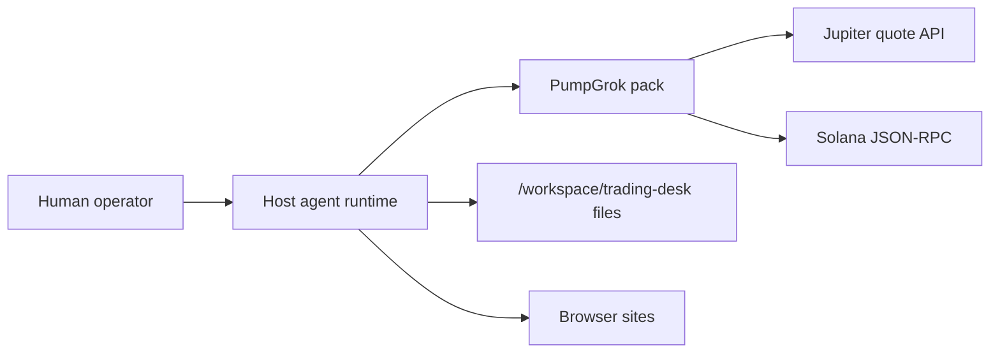
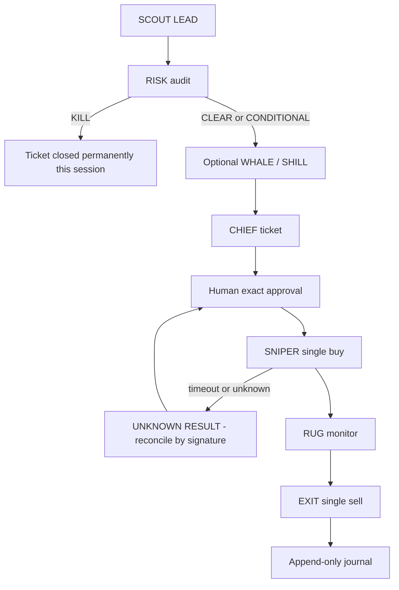

# PumpGrok architecture

Maintainer map of this repository. PumpGrok is an instruction pack plus small read-only CLIs, not a long-running application.

## Overview

PumpGrok turns a host agent runtime into an eight-role Solana memecoin trading desk.

| Layer | What it is | What it is not |
|-------|------------|----------------|
| `agents/*.md` | Role profiles and standing instructions, including the Global Security Constitution | Executable workers |
| `skills/*/SKILL.md` | Named procedures the host loads by frontmatter `name` | A framework or SDK |
| `rules/pumpgrok-team.mdc` | Always-applied constitution (`alwaysApply: true`) | Runtime enforcement code |
| `tools/*.py` | Fail-closed JSON CLIs | Signers, senders, or wallets |
| Plugin manifests | How Cursor / Claude Code / Grok Build / Grok Bot discover the pack | A deployable service |

There is no PumpGrok server, queue, or daemon in this tree. The process that “runs” the desk is the host (Grok Bot, Cursor, Claude Code, or Grok Build). Humans approve every spend by exact ticket ID. Only SNIPER may send buys; only EXIT may send sells.

## System context

External systems named in skills or tools:

| System | How PumpGrok uses it |
|--------|----------------------|
| Jupiter Quote API `https://quote-api.jup.ag/v6/quote` | `tools/jupiter_quote.py` GET; never swap/send |
| Solana JSON-RPC (default `https://api.mainnet-beta.solana.com`) | `authority_check.py` (`getAccountInfo`), `priority_fee.py` (`getRecentPrioritizationFees`), `holder_check.py` (`getTokenLargestAccounts`) |
| Optional `--rpc` URL | Same RPC methods; SETUP.md mentions a private RPC (Helius, QuickNode, etc.) as an operator choice |
| Browser sites (tool-connections / discovery) | X / Twitter, pump.fun, gmgn.ai, jupiter.ag, Photon / Axiom, solscan.io, rugcheck.xyz — opened by the human/host browser, not by these Python tools |

No database, message bus, or secrets manager is referenced. Tools take no API keys. There are no `os.environ` / `.env` readers in this repository.



## Containers or processes

Nothing in this repo is started as a service.

| Runtime | How it is started | Responsibility |
|---------|-------------------|----------------|
| Host agent | Operator opens the repo / installs the plugin | Loads agents, skills, and rules; talks on the Trading Floor; may invoke tools |
| `python tools/*.py` | One-shot CLI from the repo root | Structured reads / paper journal appends |
| `./scripts/check.sh` | One-shot from the repo root | Offline lint of instruction files |
| Human wallet (throwaway, outside this repo) | Screen hand-off only (`tool-connections`) | Actual signing; never handled by PumpGrok files |

`rules/pumpgrok-team.mdc`: if the host has no persistent Bots or group chats, use subagents or role-labelled passes and state which fallback is active. Do not invent a Bot-creation API.

## Module map

Dependency direction observed in the tree: **rules constrain agents; agents name skills; skills prefer tools; tools talk to public HTTP/RPC; none of those layers import each other as code.**

```
plugin manifests  -->  agents/  skills/  rules/
rules/pumpgrok-team.mdc  -->  agents/*  (roles + hard constraints)
agents/*.md  -->  skills/*  (frontmatter skills: lists)
skills/*  -->  tools/*.py  (documented CLI, not Python imports)
tools/*.py  -->  Jupiter / Solana RPC / local trading-desk files
scripts/check.sh  -->  agents/, skills/, rules/  (read-only validation)
```

### Agents (`agents/`)

| File | Role | `writes_to_exchange` | Skills listed in frontmatter |
|------|------|----------------------|------------------------------|
| `chief.md` | Desk orchestrator; never trades | false | desk-operating-model, desk-trade-lifecycle, desk-risk-limits, desk-monitoring, desk-post-trade-review, desk-incident-response, pumpgrok-setup, tool-connections |
| `scout.md` | Discovery / LEAD schema | false | discovery-tools, solana-market-data, social-sentiment, desk-trade-lifecycle |
| `risk.md` | Absolute safety gate; CLEAR / CONDITIONAL / KILL | false | risk-audit, desk-risk-limits, solana-market-data, solana-rpc-and-wallet |
| `whale.md` | Holder / smart-money context after RISK | false | holder-and-flow-analysis, solana-market-data, discovery-tools |
| `sniper.md` | Only buy sender | true | jupiter-routing, desk-execution-protocol, solana-rpc-and-wallet, solana-api-reference, solana-market-data |
| `rug.md` | Post-fill red-flag monitor; never closes | false | position-monitoring, desk-monitoring, solana-market-data |
| `exit.md` | Only sell sender | true | position-monitoring, desk-execution-protocol, desk-post-trade-review, jupiter-routing |
| `shill.md` | Social velocity / quality | false | social-sentiment, discovery-tools |

SETUP.md Trading Floor group: CHIEF, SCOUT, RISK, WHALE, SNIPER, RUG. EXIT and SHILL may be DMs if the host caps group size at six.

### Skills (`skills/`)

Each directory has one `SKILL.md` whose frontmatter `name` must match the directory (`scripts/check.sh` enforces this).

| Group | Skills |
|-------|--------|
| Bootstrap | pumpgrok-setup, tool-connections, desk-operating-model, desk-folders-and-journal |
| Process and risk | desk-trade-lifecycle, desk-risk-limits, desk-execution-protocol, risk-audit, desk-monitoring, desk-post-trade-review, desk-incident-response, desk-strategy-lab |
| Domain | discovery-tools, jupiter-routing, position-monitoring, holder-and-flow-analysis, social-sentiment, solana-market-data, solana-api-reference, solana-rpc-and-wallet, browser-ops |

`desk-operating-model` is the constitution. `desk-trade-lifecycle` is the ticket procedure. `risk-audit` and `jupiter-routing` are the critical domain skills (`rules/pumpgrok-team.mdc`).

### Tools (`tools/`)

All tools: CLI, JSON on stdout, fail closed (`ok: false` + error), no private keys, no signing, no sends.

| Script | Outbound call or write | CLI (as implemented) |
|--------|------------------------|----------------------|
| `jupiter_quote.py` | GET Jupiter `/v6/quote` | `--input-mint` `--output-mint` `--amount` `--slippage-bps` |
| `authority_check.py` | RPC `getAccountInfo` jsonParsed | `--mint` `--rpc` |
| `priority_fee.py` | RPC `getRecentPrioritizationFees` | `--rpc` `--percentile` `--multiplier` |
| `holder_check.py` | RPC `getTokenLargestAccounts` | `--mint` `--rpc` `--limit` |
| `ticket_helper.py` | Local proposal files | subcommands `next`, `create --mint [--size] [--slippage]`, `list` |
| `paper_sim.py` | Append journal markdown | `--desk` `--action` `--ticket` `--mint` `--size-usd` `--price` `--slippage-bps` `--reason` `--note` |

### Plugin manifests

| File | Host |
|------|------|
| `plugin.json` | agent-plugins.org schema; Grok Bot |
| `.claude-plugin/plugin.json` + `marketplace.json` | Claude Code |
| `.cursor-plugin/plugin.json` | Cursor (`skills`, `agents`, `rules` paths) |
| `.grok-plugin/plugin.json` + `marketplace.json` | Grok Build |

## Data and control flow

Ticket ID format: `SOL-YYYYMMDD-NNN`.

Stages in `skills/desk-trade-lifecycle/SKILL.md` (strict order):

1. Lead (SCOUT) — LEAD block with mint + source + UTC
2. Audit (RISK) — fail-closed 10-check list; verdict CLEAR, CONDITIONAL, or KILL
3. Context (optional WHALE + SHILL)
4. Ticket creation (CHIEF) — `tools/ticket_helper.py`
5. Human approval — message must contain ticket ID + mint + size + max slippage; analysis is not approval
6. Single buy (SNIPER) — Jupiter quote + priority fee; send once
7. Monitor (RUG) — alerts only
8. Exit (EXIT) — sells only, same single-send rule
9. Journal (CHIEF + EXIT)



Retry behavior that **is** implemented as policy (instructions, not code): on unknown, timeout, or failed send, SNIPER/EXIT must not auto-retry; they report `UNKNOWN RESULT – reconcile by signature` and wait for a fresh human approval.

Tool-level errors: HTTP/RPC exceptions become `{"ok": false, "error": ...}` JSON; process exits 0 after printing that JSON except missing `requests` (exit 1) and unknown `ticket_helper` command (exit 1).

Engagement levels (`desk-operating-model`): **research** (no money), **paper** (`paper_sim.py`), **micro-live** (throwaway wallet after explicit confirmation). Daily loss ≥ 5% of wallet equity → CHIEF posts `FLOOR HALTED – DAILY LOSS LIMIT` and refuses new entries until the human resets.

## Persistence

No database, migrations, or cache layer.

Desk files live **outside** the git tree, conventionally:

```
/workspace/trading-desk/
  proposals/     ticket_helper.py create
  briefs/
  leads/
  research/
  journal/       paper_sim.py appends paper-YYYY-MM-DD.md
  incidents/
  positions/
  watch/
  risk-limits.md
  desk.md        engagement, public wallet address, daily loss limit
```

Journal rules (`desk-folders-and-journal`): append-only; every entry needs ticket ID and UTC. `ticket_helper.py` uses `/workspace/trading-desk/proposals` when `/workspace` exists, else `./trading-desk/proposals`. `paper_sim.py` defaults `--desk /workspace/trading-desk`.

This repository itself stores only instruction files, plugin JSON, Python helpers, `SETUP.md`, and `banner.jpg`.

## Configuration and secrets

| Mechanism | Where |
|-----------|--------|
| `--rpc` | `authority_check.py`, `priority_fee.py`, `holder_check.py` |
| `--desk` | `paper_sim.py` (default `/workspace/trading-desk`) |
| Quote params | `jupiter_quote.py` flags |
| Desk record | `/workspace/trading-desk/desk.md` (engagement, public address, RPC note) |
| Risk numbers | `/workspace/trading-desk/risk-limits.md` from the RISK/CHIEF interview |

Do not put seed phrases, private keys, or live RPC credentials in git. Connection is screen hand-off; only the public address is recorded. Tools do not read environment variables.

## Cross-cutting

**Auth / keys.** Global Security Constitution in every agent file and in `desk-operating-model`: never request, accept, store, print, or reason about seed phrases or private keys. Throwaway wallet ≤ $200 USDC + SOL for fees.

**Approval.** Human message with exact ticket ID + mint + size + max slippage after the ticket was shown. Earlier messages are not consent.

**Write boundary.** `scripts/check.sh` expects only `sniper` and `exit` to set `writes_to_exchange: true` (soft check).

**Observability.** Instruction-level: UTC-timestamped sourced evidence, ticket IDs in the journal, CHIEF desk status. No metrics/tracing code.

**Feature flags.** None. Engagement level in `desk.md` is the mode switch.

**Validation.** `scripts/check.sh`: YAML frontmatter on agents and skills, skill `name` matches directory, constitution phrase spot-check, `rules/pumpgrok-team.mdc` exists, no emoji in markdown / `.mdc`. Stdlib Python only; no network.

## Change guidance

| Change | Typical landing | Do not couple |
|--------|-----------------|---------------|
| New role constraint | `rules/pumpgrok-team.mdc` + matching standing instructions in every `agents/*.md` | Do not encode veto/approval in Python |
| New procedure | `skills/<name>/SKILL.md` with matching `name`, then add it to the relevant agent `skills:` list | Do not put strategy or return claims in skills (`rules` forbid it) |
| New structured read | `tools/*.py` JSON CLI, fail closed, no signing | Do not add send/swap/sign paths |
| Host packaging | The matching `plugin.json` / marketplace file | Do not invent a Bot-creation API |
| Bootstrap steps | `SETUP.md` and `skills/pumpgrok-setup/SKILL.md` | Do not raise engagement to micro-live in setup |
| Lint rules | `scripts/check.sh` | Keep it offline |

Keep tools read/prepare-only. Keep RISK KILL non-overridable. Keep SNIPER/EXIT as the only exchange writers.

## Unknowns

- Plugin manifests still contain `"license": "MIT"` and placeholder `https://github.com/your-org/pumpgrok` URLs. The root [LICENSE](LICENSE) is GNU Affero General Public License v3.0 for Spectrum Web Co LLC / swcstudiospace. Manifests were not changed in this documentation pass.
- `skills/desk-trade-lifecycle/SKILL.md` and `tools/README.md` mention `ticket_helper.py --write`. The implemented CLI is subcommands `next` / `create` / `list`.
- `jupiter-routing` and `tools/README.md` show `priority_fee.py --max-micro 50000`. The implemented flags are `--rpc`, `--percentile`, `--multiplier` (default 1.2).
- Whether a given host actually creates eight persistent Bots and a Trading Floor group depends on that host. This repo only supplies files and SETUP.md instructions.
- No automated tests exist beyond `scripts/check.sh`.
